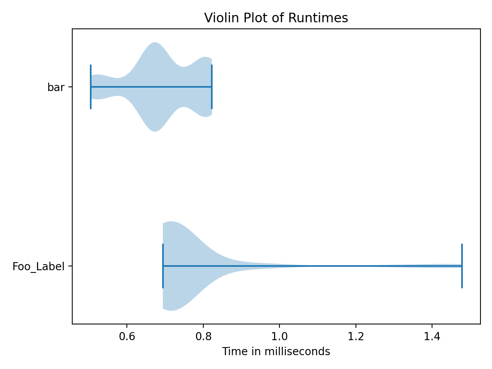

# Tinybench [](https://travis-ci.com/mickyabir/tinybench)

Tinybench is a lightweight package to time, compare, and visualize various functions.  This package was inspired by the R package [microbenchmark](https://cran.r-project.org/web/packages/microbenchmark/index.html)

## Installation

```bash
pip install tinybench
```

## Usage

```python
from tinybench import benchmark, benchmark_env

# create two functions example functions to test
def foo(a):
	test = []
	for i in range(a):
		test.append(i)
	return test

def bar(a, b):
	return a + b

# example input variable
c = 10000

iterations = 100
warmup = 10

# env should be globals(), or use benchmark_env(functions_list)
# functions_list should at least contain all the functions to benchmark
env = benchmark_env([foo, bar])

# instead, using globals() is recommended
env = globals()

b = benchmark(['Foo_Label:foo(c)', 'bar(10, 15)'], iterations, warmup, env)
print(b)
b.plot()

# alternatively, we can benchmark using the process time instead of real time:
b_process = benchmark(['Foo_Label:foo(c)', 'bar(10, 15)'], iterations, warmup, env, process_time = True)

```



## Support

For any help or questions, please open an issue on GitHub.

## License

[MIT](https://github.com/mickyabir/tinybench/blob/master/LICENSE)
